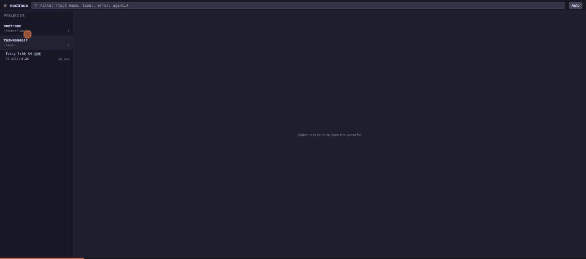
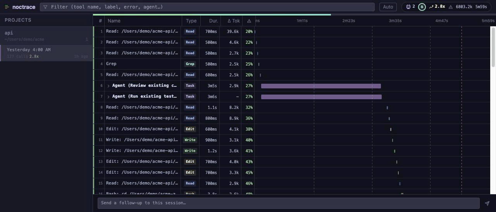
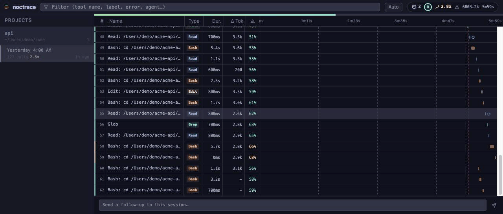

<p align="center">
  
</p>

<p align="center">
  Chrome DevTools Network-tab-style waterfall visualizer for <a href="https://docs.anthropic.com/en/docs/claude-code">Claude Code</a> agent workflows.
  <br />
  Zero config. Zero cloud. Just run <code>npx noctrace</code> and see what your agents are doing.
</p>

<p align="center">
  <a href="https://www.npmjs.com/package/noctrace"></a>
  <a href="https://github.com/nyktora/noctrace/blob/main/LICENSE"></a>
  <a href="https://www.npmjs.com/package/noctrace"></a>
</p>

---

<p align="center">
  
</p>

## Why

Claude Code's terminal output is opaque. Tool calls show summaries like "Read 3 files" and "Edited 2 files" — no paths, no timing, no concurrency visibility. When sub-agents spawn sub-agents, you're flying blind.

Noctrace reads Claude Code's session logs from `~/.claude/projects/` and renders them as an interactive waterfall timeline — the same visual paradigm that makes Chrome DevTools' Network tab instantly readable.

## Install

```bash
# Run directly (no install needed)
npx noctrace

# Or install globally
npm install -g noctrace
noctrace
```

### As a Claude Code Plugin

```bash
claude plugin install nyktora/noctrace
```

Requires Node.js 20+. That's it. No config required. Optional hooks for real-time events.

## Features

- **Waterfall timeline** — horizontal bars on a shared time axis showing tool call concurrency and duration
- **Collapsible agent groups** — sub-agents as expandable row groups with real execution time bars showing parallel work
- **Sub-agent visibility** — parses sub-agent JSONL files to show what happened inside each agent
- **Real-time updates** — file watcher pushes new events via WebSocket as your session runs
- **Token drift detection** — tracks how per-turn token cost drifts from baseline, warns when sessions burn excessive quota
- **Context Health grade** — A-F letter grade from 5 signals with actionable recommendations
- **Compact stats pill** — toolbar shows agent count, health grade, drift factor, total tokens, and session duration at a glance
- **Filter with highlighting** — search by tool name, label, or keywords (`error`, `agent`, `running`) with yellow match highlighting
- **Virtual scrolling** — handles sessions with thousands of tool calls
- **Zoom & pan** — mouse wheel zoom (1-50x), click-drag pan
- **Detail panel** — click any row for full tool input/output, resizable
- **Re-read detection** — flags duplicate file reads that waste context
- **Dark theme** — Catppuccin Mocha palette
- **Session export** — share sessions as standalone offline HTML files
- **Hooks integration** — optional real-time event streaming from Claude Code
- **Context Drift Rate** — detect accelerating token growth before context rot hits



### Token Drift

The stats pill shows a **drift factor** (e.g. `2.8x`) measuring how much each turn costs compared to the session's baseline. A 10x drift means every turn burns 10x more quota than it did at the start. Session picker shows drift per-session so you can spot wasteful sessions at a glance.

### Context Health



Noctrace computes a real-time health score from your session data and warns you before context rot degrades output quality. The breakdown panel shows per-signal grades and tells you exactly when to run `/compact`.

| Signal | Weight | What it measures |
|--------|--------|-----------------|
| Context Fill | 40% | How full is the context window (auto-detected per model) |
| Compactions | 25% | Number of lossy compaction events |
| Re-reads | 15% | Duplicate file reads (retrieval failures) |
| Error Rate | 10% | Accelerating errors in second half of session |
| Tool Efficiency | 10% | Declining productive output |

### Detail Panel


Click any row to inspect the full tool input and output. Two-column layout shows the request on the left and response on the right. Resizable, closes with Esc.

## How it works

1. Starts a local server on `http://localhost:4117` (auto-finds next available port)
2. Opens your browser
3. Reads JSONL session logs from `~/.claude/projects/`
4. Parses tool_use/tool_result pairs into a waterfall timeline
5. Watches active session files for real-time updates via WebSocket

No config files. No cloud. Everything stays local. Optional hooks for richer real-time data.

## Configuration

| Environment Variable | Default | Description |
|---------------------|---------|-------------|
| `PORT` | `4117` | Server port (auto-increments if busy) |
| `CLAUDE_HOME` | `~/.claude` | Override Claude home directory |

| CLI Flag | Description |
|----------|-------------|
| `--install-hooks` | Configure Claude Code to push real-time events to noctrace |
| `--uninstall-hooks` | Remove noctrace hooks from Claude Code |

## Development

```bash
git clone https://github.com/nyktora/noctrace.git
cd noctrace
npm install
npm run dev       # starts server + Vite dev server
```

| Command | Description |
|---------|-------------|
| `npm run dev` | Start dev server with HMR |
| `npm run build` | Production build (client + server) |
| `npm test` | Run test suite (Vitest) |
| `npm run typecheck` | TypeScript type checking |
| `npm run lint` | ESLint |

## Tech Stack

- **Server**: Express 5, ws, chokidar
- **Client**: React 19, Vite 8, Tailwind CSS 4, Zustand 5
- **Tests**: Vitest 4
- **Language**: TypeScript 5.9 (strict mode)

## License

[MIT](LICENSE)

---

<p align="center">
  Created and maintained by <a href="https://nyktora.com">Nyktora Group</a> · Contributions welcome
</p>
